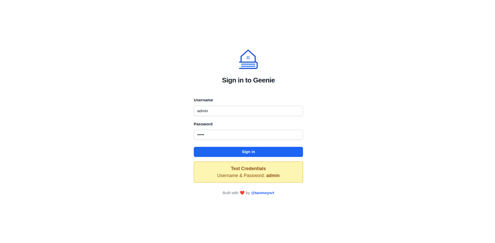
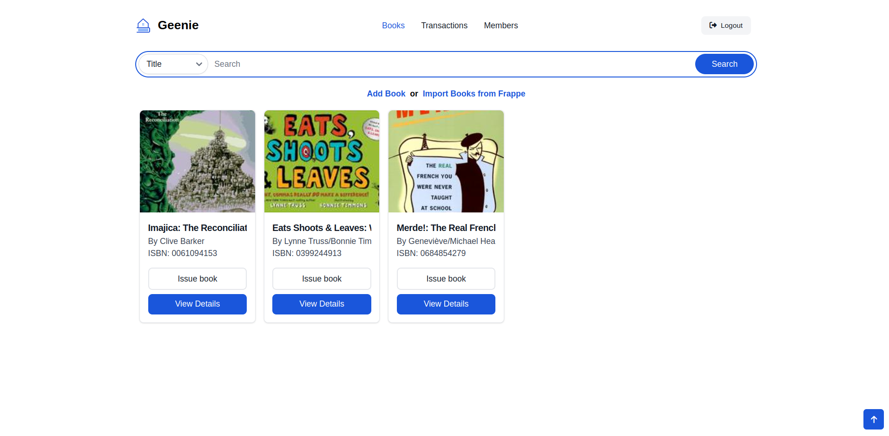
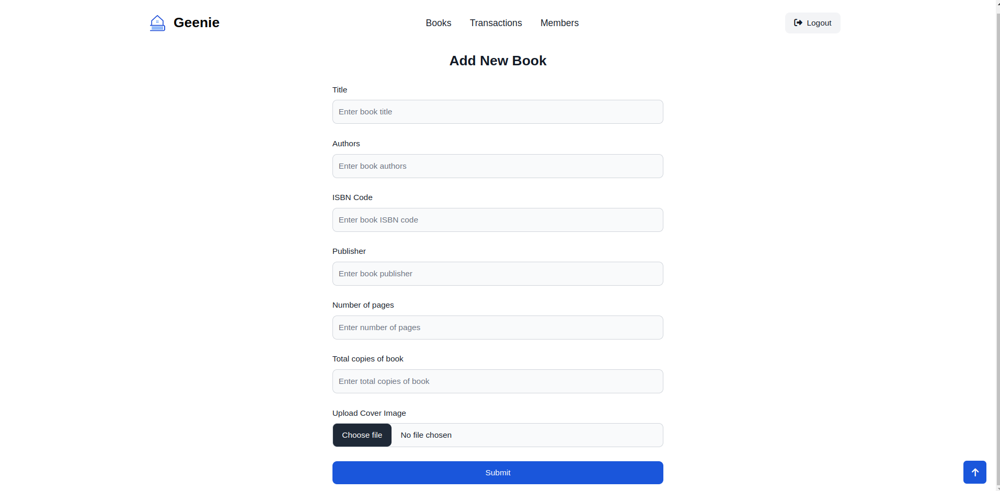
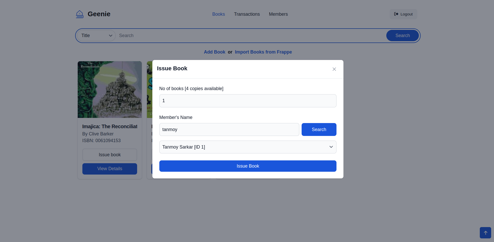
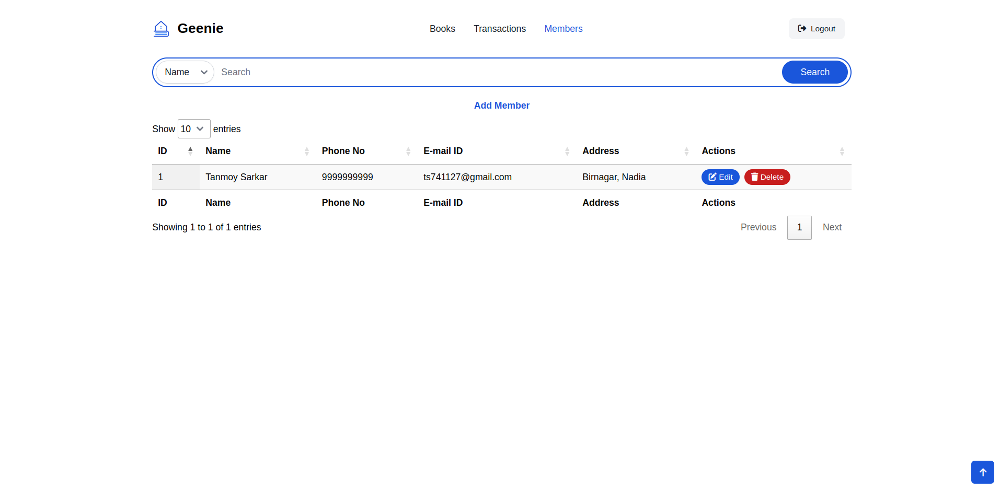
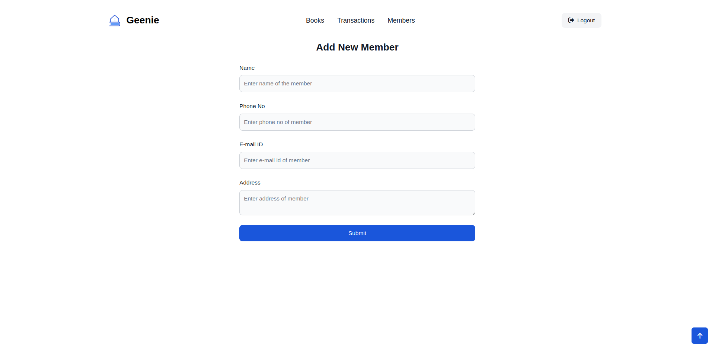

# 📚 Geenie - Library Management Software

**Geenie** is a library management software that helps you manage your library with ease.

---

### 🌀 Features
- Add books to your library
- Import books from Frappe API
- Search books by title, author, isbn, publisher
- Edit / Delete books
- Add / Edit / Delete members
- Issue / Return books
- View issued books

### 🌐 Live Demo
Check out the live demo here - https://geenie.tanmoy.online/

*Test Credentials*
 - *Username*: `admin`
 - *Password*: `admin`

### 🛠 Installation
-   #### Local Setup via Docker
    - Clone the repo
    - Run the following command
        ```bash
        sudo docker compose up -d
        ```
    - Visit http://localhost:5000

-   #### Local Setup via Python
    - Clone the repo
    - Copy the `.env.example` file to `.env` and fill in the details
    - Install the python dependencies
        ```bash
        pip install -r requirements.txt
        ```
    - Run the following command
        ```bash
        python run.py
        ```
    - Visit http://localhost:5000

### ⚡ Tech Stack
- Python
- Flask
- Flask SQLAlchemy
- Tailwind CSS
- Jinja2

### 🖼 Screenshots
- **Login To Geenie**


- **Search & List Books**


- **Manually Add Books**


- **Import Books from Frappe API**


- **Show Book Details**


- **Issue Book**


- **Search & List Members**


- **Add New Member**


- **Transaction History**

- **Return Book**

### 📝 Disclaimer
This project is part of Frappe Dev Hiring Challenge. You can find more details in the [page](https://frappe.io/dev-hiring-test)